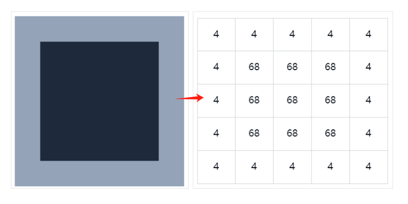
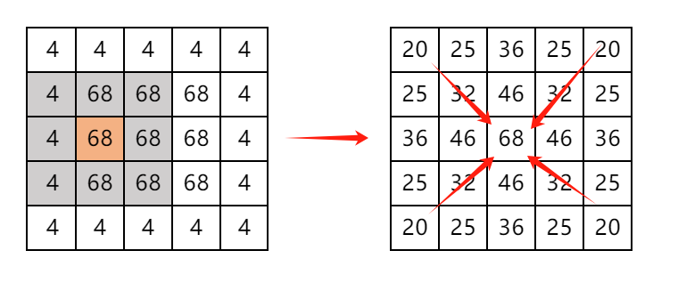
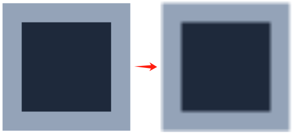
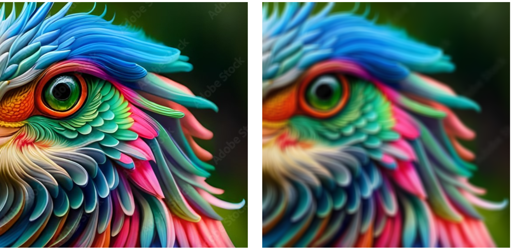
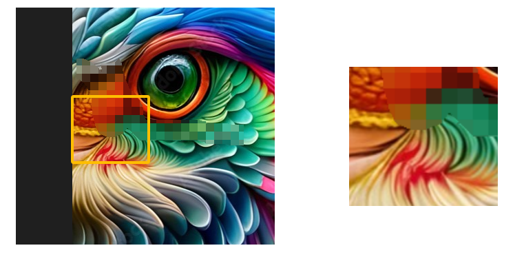
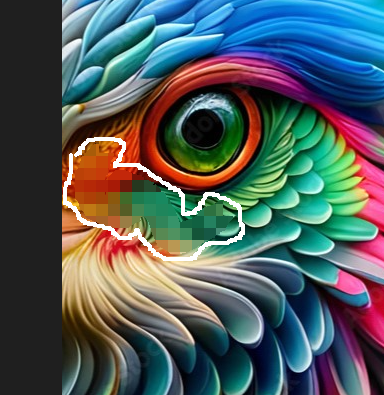
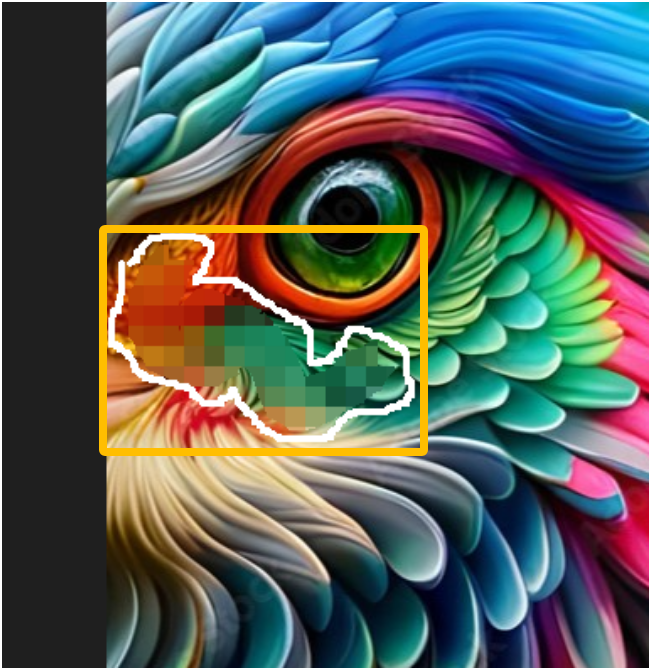
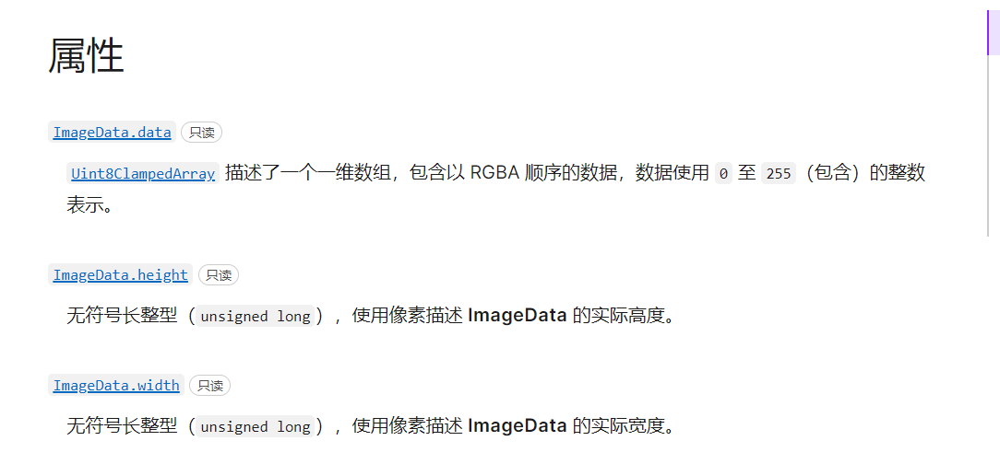
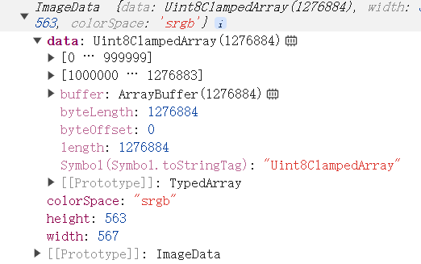
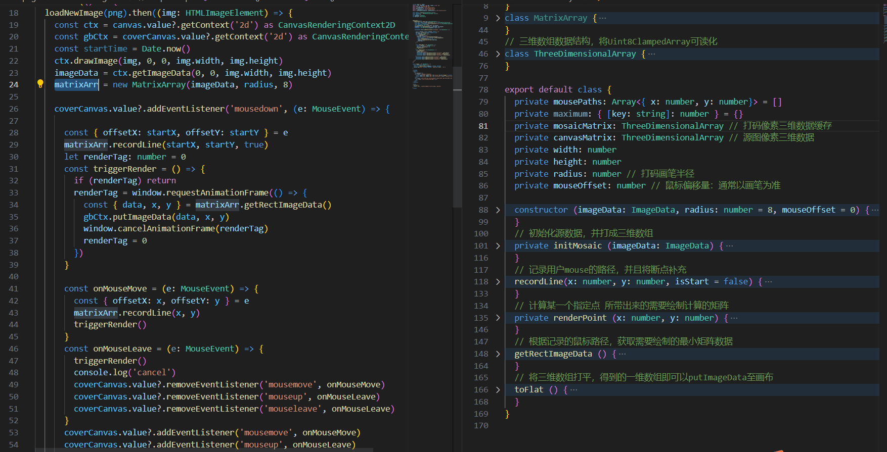

# 前端实现类微信的图片打码？对图片做高斯模糊？

## 提要
对于部分基础知识，文章不会详细解释，类似事件、语法


第一部分简单介绍高斯模糊，不感兴趣的客官可以直接看第二部分图片打码的详细设计

## 基础知识
在研究高斯模糊的概念中发现了滤波器的概念，在图像处理中是一个非常有意思的概念，对于每一张图片，都是由像素点组成的，而每一个像素点的色值即`rgba`是固定的，我们将色值抽象为一个固定的数值，如下图假设我们将一张简单的图片抽象为一个矩阵值



如下图所示，假设我们的以橙色68为中心点建立一个3x3的矩阵为一个单位，计算这个矩阵单位的总值为420，再取矩阵单位的平均值420/9可得到约为46的值，这个值即为经过滤波计算后得到的色值，对这个矩阵的每个点进行类似计算即可得到一个逐渐向中心收敛的矩阵





透过这个矩阵我们可以发现，他的边界曲线变得更加的平滑且收敛，如果将其换算至对应的像素值概念，我们就能发现对应的图像变化

## 高斯模糊

遵循上述的计算规则，我们来看一张运用高斯模糊前后的对比



从对比图可以看出这种效果非常类似图片被压缩后的样子，但实际上他的边缘被平滑处理，通过对比两种颜色交汇处的色彩可以发现原本锐化的界限出现了一条从浅至深的颜色变化曲线，这就是高斯模糊的概念，

图片元素可能太简单，下面来一张复杂的图，实测一张图片的变化

为了更好的对比效果，将模糊半径提高至5来对比高斯模糊后的效果





## 图片打码

对图片打码初识比较神秘，但是看下面一张细节图就能看懂原理



左侧是一张原图，对其部分进行打码后进行放大，通过对比就能发现，打码过的区域变成了统一的某个色值，

通过上面的对比图其实就能看出，所谓的打码就是对某个固定范围的矩阵内像素进行均化，借用上述用到的滤波器的概念，对固定范围内的色值取出均值，用这个均值铺满指定的矩阵，就能得出打码后的效果，步骤也可以简化为

* 绘制原图至画布，取得图片的元数据
* 捕捉用户行为轨迹，即记录鼠标`连续的移动轨迹`
* 根据用户轨迹计算最小打码绘制范围
* 计算打码绘制元数据，根据绘制范围绘制于画布

接下来的事件拆解不会严格按照上述步骤，整个过程更加像一个真实的开发过程，

#### 事件
最开始的事情就是做好整个事件模型，毫无疑问想要对图片进行操作就离不开`canvas`，通过`drawImage`将图片写入，随后就可以在canvas上对图片进行编辑

```` ts
  coverCanvas.value?.addEventListener('mousedown', (e: MouseEvent) => {
    const { offsetX: startX, offsetY: startY } = e
    let renderTag = 0
    const triggerRender = () => {
      if (renderTag) return
      renderTag = window.requestAnimationFrame(() => {
        // render action
        window.cancelAnimationFrame(renderTag)
        renderTag = 0
      })
    }
    
    const onMouseMove = () => {
      triggerRender()
    }
    const onMouseLeave = () => {
      console.log('cancel')
      coverCanvas.value?.removeEventListener('mousemove', onMouseMove)
      coverCanvas.value?.removeEventListener('mouseup', onMouseLeave)
      coverCanvas.value?.removeEventListener('mouseleave', onMouseLeave)
    }
    coverCanvas.value?.addEventListener('mousemove', onMouseMove)
    coverCanvas.value?.addEventListener('mouseup', onMouseLeave)
    coverCanvas.value?.addEventListener('mouseleave', onMouseLeave)
  })

````

#### 渲染
整个打码行为的发生只有两个地方会触发渲染，

1、使用[drawImage](https://developer.mozilla.org/zh-CN/docs/Web/API/CanvasRenderingContext2D/drawImage)是对图像的初始化，需要将一张指定的图片渲染进画布才能进行后续的所有的操作，此处对api不再赘叙，


2、当我们得到用户移动的坐标，并且计算出渲染矩阵的均值后，就需要用均值将指定的打码矩阵填充，从而实现视觉效果上的改变，


这一步如果单纯讨论渲染，则有很多种绘制方式，canvas的各种绘制api都能满足要求，但是不可忽略的一点是，用户的操作是连续的，但是产生的矩阵并非连续的，想要实现非线性的画布绘图需要的计算量不可忽视，



此处我们选择[putImageData](https://developer.mozilla.org/zh-CN/docs/Web/API/CanvasRenderingContext2D/putImageData),它能够将指定范围内的像素级数据绘制到画布中，相比线性绘制他更加灵活且可定制，所以我们只需要计算用户移动的范围的最大矩阵坐标，再算出原图中的指定范围像素作为整个区域的底图，再底图之上附加一层打码范围内的像素级均值，即可得到效果



考虑到`绘制画布的资源消耗是远远大于纯js计算`的，所以底图的计算获取以及打码范围内的均值填充，我们都需要在js计算层面完成，最终确保将所得到的像素数据一次性更新绘制到指定的区域即完成了一次打码的流程


#### 计算
想要编辑、计算这份图像，我们就需要获取这份图片的源数据，这里借助[getImageData](https://developer.mozilla.org/zh-CN/docs/Web/API/CanvasRenderingContext2D/getImageData)来获取像素级别的数据[ImageData](https://developer.mozilla.org/zh-CN/docs/Web/API/ImageData),这里我们主要使用imgData.data, 他是一个以rgba组成的一维数组



这样说可能有点抽象，我们用伪代码来演示一下即可
````ts
const { height, width, data } = ctx.getImageData(0, 0, img.width, img.height)
const pixel1 = data.slice(0, 4) // 第一个像素点，数组项分别是[r,g,b,a]
const pixel2 = data.slice(4, 8) // 第二个像素点，数组项分别是[r,g,b,a]
````
在这里也可以简单展开一下，可以发现getImageData返回的`ImageData`对象中，其中主要数据data是一个极长的Uint8ClampedArray数组，如下图所示一张567*563的图片，他的数据长度为1276884，实际上1276884 = 567 * 563 * 4，通过这个公式我们可以看透一张图片的本质，他就是由567 * 563个像素组成的一张图片，而每个像素点由4个0-255的整数组成的[r,g,b,a]的数组 组成




截止目前为止我们已经能够拿到整张图片的像素数据，每个像素的数据都是可以改变的，这给了极大的可操作空间，


到这一步整个思路就会清晰许多，基于鼠标移动获取的鼠标移动轨迹之后，我们能够得到一个完整的需要计算打码的范围，假设一个点为(x, y), 我们的打码画笔半径为radius，那么对于这个点，我们需要覆盖的打码范围就是从(x-radius, y-radius)到(x+radius, y+radius)

``` ts
renderPoint (x: number, y: number) {
  for (let j = y - radius; j <= y + radius; j ++) {
    if (j < 0 || j >= height) continue
    for (let i = x - radius; i <= x +radius; i ++) {
      if (i < 0 || i >= width) continue
      if (canvasMatrix.get(i, j)[3] !== 0) return
      // 以下是得到绘制点的打码后的像素值
      canvasMatrix.set(i, j, this.mosaicMatrix.get(i, j))
    }
  }
}

```
线段是由有限个点组成，一个基准点的绘制范围计算如此，那么计算一条连续的移动轨迹自然就是将所有点遍历一遍即可，
````ts
// 记录用户mouse的路径，并且将断点补充
recordLine(x: number, y: number, isStart = false) {
  // 避免断连，需要计算连续度
  const endPoint = this.mousePaths[this.mousePaths.length - 1]
  const func = (point: PointType) => {
    this.renderPoint(point.x, point.y)
    this.mousePaths.push(point)
  }
  if (!endPoint || isStart) { // 第一次落点
    func({ x, y })
  } else {
    // 补充断点
    const moveLine = getConnectionLine(endPoint, { x, y })
    // 根据轨迹计算绘制范围
    moveLine.forEach(func)
  }
}

````
行文至此，大体上的设计实现思路是如此，至于要一步一步精细化的贴出代码就会拉长整个文章的长度，既没精力也无必要，下面贴一个完整代码的框架，如果有人需要源码的话后面再贴仓库链接吧



## 一些絮叨
如上文所述，整个计算过程略显繁复，一一说完耗神耗力，整个过程踩坑无数，下面分享几个

1、 虽说我们一直在说图片由rgba的整数组成像素点，而实际上当我们将图片绘制到canvas上时，就已经抛弃了透明度的概念，所以在每个像素点的数据中，实际上他的a值都是固定255的

2、 如果我们仔细观察，就会发现，默认鼠标的识别点，并非常规意义上的整个icon的中间点，而是左上角的坐标原点，即x=0,y=0的点，如果我们不做任何处理，包括我们用自定义的icon替换鼠标之后，他的点击相应点依旧是左上角，假如我们默认用一个8x8的画笔去打码，最终绘制效果会x、y各自偏移4，所以在绘制计算的基准点中需要加入 对鼠标的偏移计算

3、 在mouse-move的过程中，鼠标移动速度达到一个上限之后，上一次trigger的坐标与下一次触发的坐标之间是存在断点的，这就是触发了浏览器的节流策略，为了更好的节省资源，他并不会逐个像素的给开发者暴露鼠标的完整移动轨迹，这就导致我们的监听绘制事件出现了断点，从而导致我们的渲染出现不连续的绘制，

要解决这个问题其实也非常简单，既然两点之间不连续，那将他变成连续的就行了，遍历这一个点与上一个点的横纵坐标之差，得到的数据就是被间断未被捕捉的轨迹，从而我们能得到一条完整的用户轨迹


> 从理论上来说，用户的移动行为是连续的，每一次mouse-move绘制的轨迹可以看做一条曲线，而这条曲线其中出现的断点，如果贸然用直线链接断点其实并不符合用户习惯，其实通过断点前后的曲线弧度变化，能够计算一条弧度变化曲线


4、其实一个特定点a: (x, y), 他的打码后的像素值是固定，与用户的行为无关，所以在图片被渲染出来的时候，我们就能够得到整张图片的固定打码后的像素矩阵值了，如果我们在渲染的时候就将全部像素值计算出来，那么用户移动时就可以省去计算步骤，直接取有效值即可，现有代码采用的实际上就是这一种方式，有效的避免了因为计算可能带来的绘制卡顿导致用户体验跟手感不佳


## 最后的性能考虑
拿高斯模糊中图片举例，对于843kB大小、尺寸为857 * 566的图片，其生成的类数组长度为857 * 566 * 4=1940248个字节长度，其整体的数据长度就达到了将近1M大小，


在高斯模糊的计算中，每个像素点均需要以滤波器为单位来单独计算其像素值，如案例中所示，如果滤波器是是一个7 * 7的矩阵，一张如案例所示的小型图片需要经过857 * 566 * 49次计算，才能对整张图片进行完整高斯模糊，
如此量级的计算压力，在经过多次测试后发现，在现代浏览器中对于这种类型大小的图片进行高斯模糊大约需要5s，而这仅仅还只是将高斯半径设置为3个像素即以7*7为单位的情况下，这种时间消耗如果在toC端则是不可忽视的影响


在图片打码过程中，我们提前计算整张图的结果绘制矩阵，虽然原理类似，但是不需要从滤波器中取均值，所以计算压力与滤波并不在一个量级上
